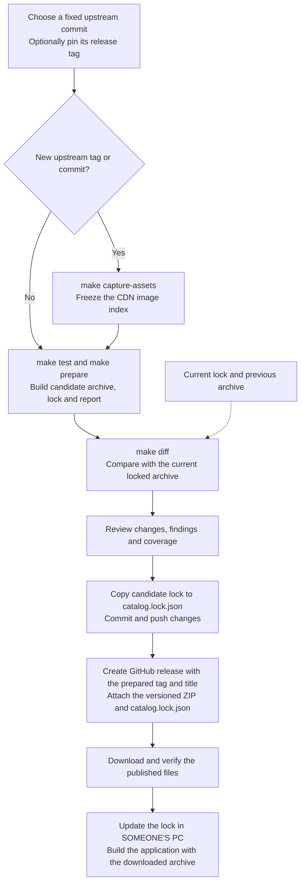

# Catalog workflow

See [Building and publishing catalogs](building.md) for the commands and release rules.

```mermaid
flowchart TD
    inputs["Choose a fixed upstream commit<br/>Optionally pin its release tag"]
    inputs --> changed{"New upstream tag or commit?"}
    changed -->|Yes| capture["make capture-assets<br/>Freeze the CDN image index"]
    changed -->|No| build["make test and make prepare<br/>Build candidate archive, lock and report"]
    capture --> build
    build --> compare["make diff<br/>Compare with the current locked archive"]
    previous["Current lock and previous archive"] -.-> compare
    compare --> review["Review changes, findings and coverage"]
    review --> adopt["Copy candidate lock to catalog.lock.json<br/>Commit and push changes"]
    adopt --> publish["Create GitHub release with the prepared tag and title<br/>Attach the versioned ZIP and catalog.lock.json"]
    publish --> verify["Download and verify the published files"]
    verify --> app["Update the lock in SOMEONE'S PC<br/>Build the application with the downloaded archive"]
```
